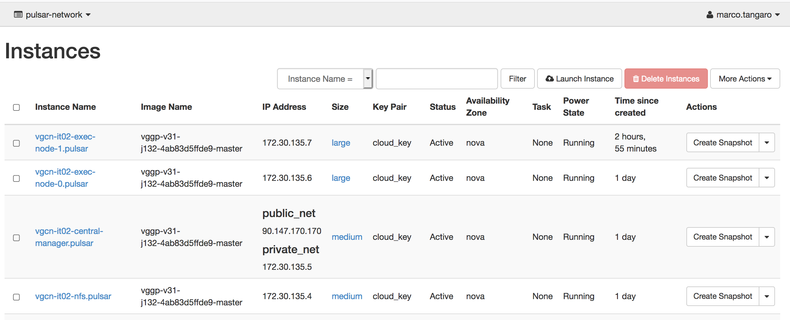
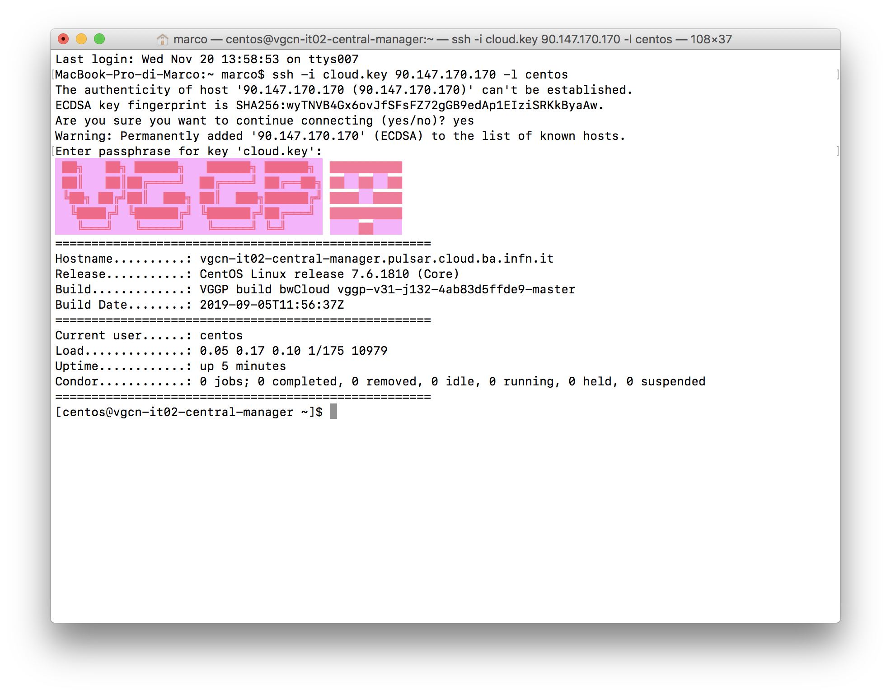

Building the Pulsar endpoint
============================

After having properly edited the ``pre_tasks.tf`` and ``vars.tf`` file (see section :doc:`vars_tf`),
we are ready to create the Pulsar endpoint.

.. note::

   For this step you need a SSH Key pair and RabbitMQ credentials from UseGalaxy.eu.

Navigate into the Pulsar infrastructure directory:

::

  cd pulsar-deployment/tf

and execute:

::

  terraform init

  terraform plan

  terraform apply -var "pvt_key=~/.ssh/<key>" -var "condor_pass=<condor-password>" -var "mq_string=pyamqp://<pulsar>:<password>@mq.galaxyproject.eu:5671//pulsar/<pulsar>?ssl=1"

The ``apply`` command output the IP addresses of the Pulsar Central Manager

::

  ...
  openstack_compute_instance_v2.exec-node: Still creating... (10s elapsed)
  openstack_compute_instance_v2.exec-node: Creation complete after 17s (ID: 046f2d5e-5bf8-4e75-8015-4e6a4f96fb9d)
  
  Apply complete! Resources: 4 added, 0 changed, 0 destroyed.
  
  Outputs:
  
  ip_v4_internal = 172.30.135.5
  ip_v4_public = 90.147.170.170
  node_name = vgcn-it02-central-manager.pulsar

Finally, all the resources have been created on OpenStack.

Here, for example, the OpenStack dashboard showing a Pulsar endpoint with the Central Manager, the NFS server and two worker nodes.

The Pulsar endpoint is now configured, but Pulsar is still turned off.

.. warning::

   The central manager is configured with ansible at deployment time. The HTCondor executors are configured with ansible run by cloud-init after the VM startup. Therefore the deployment may require few more minuts to be operational.

Testing SSH access
----------------------------------

The SSH public key configured in the ``vars.tf`` file was already automatically added to the ``authorized_keys``
file of the Central Manager VM. To login to this VM just type:

::

  ssh -i <private_ssh_key> <Central-Manager-Public-IP-address> -l centos

.. note::

   Terraform scripts also add a VGCN private ssh key to the CM and the public one to the other nodes. So after successfully logged in to the CM, you can reach, without other impediments, the rest of the network.
