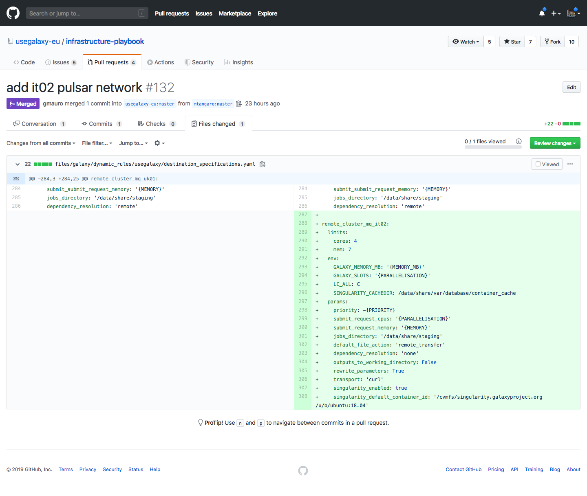

useGalaxy.eu configuration
==========================

The last step in Pulsar endpoint configuration is to enable your endpoint on useGalaxy.eu, thus allowing it to send jobs to the new endpoint. Therefore a new destination and a new runner needs to be added to usegalaxy.eu.

Destination creation
--------------------

Edit the file ``infrastructure-playbook/files/galaxy/dynamic_rules/usegalaxy/destination_specifications.yaml``, by adding at the end a new destination.

::

  remote_cluster_mq_<custom-suffix>:
    limits:
      cores: <number-of-available-cpus-per-node>
      mem: <ram-available-per-node>
    env:
      GALAXY_MEMORY_MB: '{MEMORY_MB}'
      GALAXY_SLOTS: '{PARALLELISATION}'
      LC_ALL: C
      SINGULARITY_CACHEDIR: /data/share/var/database/container_cache
    params:
      priority: -{PRIORITY}
      submit_request_cpus: '{PARALLELISATION}'
      submit_request_memory: '{MEMORY}'
      jobs_directory: '/data/share/staging'
      default_file_action: 'remote_transfer'
      dependency_resolution: 'none'
      outputs_to_working_directory: False
      rewrite_parameters: True
      transport: 'curl'
      singularity_enabled: true
      singularity_default_container_id: '/cvmfs/singularity.galaxyproject.org/u/b/ubuntu:18.04'

- Replace the ``<custom_suffix>`` using a code which identifies your country and a progressive number indicating the pulsar installation, e.g. ``it02`` for the second installation of Pulsar in Italy.

- The ``<number-of-available-cpus-per-node>`` is the number of the available worker nodes cores.

- The ``<ram-available-per-node>`` is the RAM of the Pulsar worker nodes in GB. This number will be converted in MB, thus multiplied by 1024. Therefore, to to avoid out of range memory values, we recommends to use a conservative value, for example by decreasing the value entered by 1 GB.

Runner creation
---------------

Edit the file ``infrastructure-playbook/group_vars/galaxy.yml`` and add in the ``galaxy_jobconf`` section an entry corresponding to your pulsar endpoint. Customize the ``id`` and insert the RabbitMQ URL, replacing the password with ``{{ rabbitmq_password_galaxy_<custom_suffix> }}``.

For example the runner added for ``it02`` Pulsar node is:

::

  galaxy_jobconf:
  ...
          - id: pulsar_eu_it02
            load: galaxy.jobs.runners.pulsar:PulsarMQJobRunner
            params:
              amqp_url: "pyamqp://galaxy_it02:{{ rabbitmq_password_galaxy_it02 }}@proxy.internal.galaxyproject.eu:5671//pulsar/galaxy_it02?ssl=1"
              galaxy_url: "https://usegalaxy.eu"
              manager: production
              amqp_acknowledge: True
              amqp_ack_republish_time: 300
              amqp_consumer_timeout: 2.0
              amqp_publish_retry: True
              amqp_publish_retry_max_retries: 60

Pull request to useGalaxy.eu
----------------------------

Finally, these changes must be merged to the main branch of the `infrastructure-playbook <https://github.com/usegalaxy-eu/infrastructure-playbook>`_ repository through a Pull Request.

.. warning::

   To enable this changes on usegalaxy.eu requires at least 1 working day.

.. figure:: _static/img/runner_pr.png
   :scale: 40%
   :align: center

