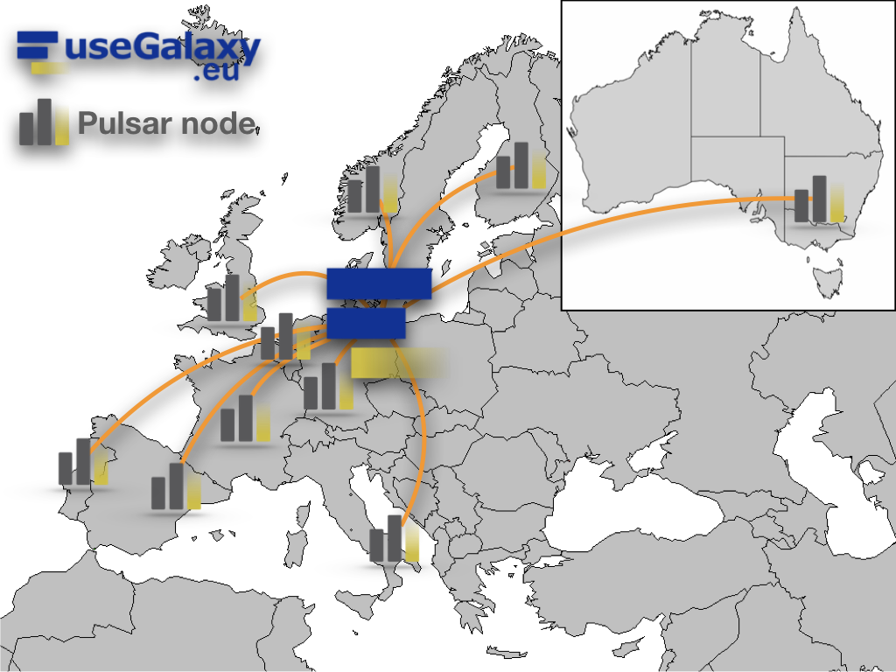

.. Pulsar-Network documentation master file, created by
   sphinx-quickstart on Thu Nov 21 12:01:00 2019.
   You can adapt this file completely to your liking, but it should at least
   contain the root `toctree` directive.

Welcome to Pulsar-Network's documentation!
==========================================

The Pulsar Network is wide job execution system distributed across several
European datacenters, allowing to scale Galaxy instances computing power
over heterogeneous resources.

This documentation shows how to install and configure a Pulsar network
endpoint on an OpenStack Cloud infrastructure and how to connect it to
useGalaxy.eu server. The same Pulsar endpoint can be associated to any Galaxy
instance, if properly configured.

.. toctree::
   :maxdepth: 2
   :caption: Pulsar Endpoint Configuration

   introduction
   requirements
   pretasks
   build_pulsar_node
   rabbitmq
   pulsar
   galaxy
   vars_tf
   benchmark

.. toctree::
   :maxdepth: 2
   :caption: About Project

   Partners <project/partners>
   Status <project/status>

Indices and tables
==================

* :ref:`genindex`
* :ref:`modindex`
* :ref:`search`
