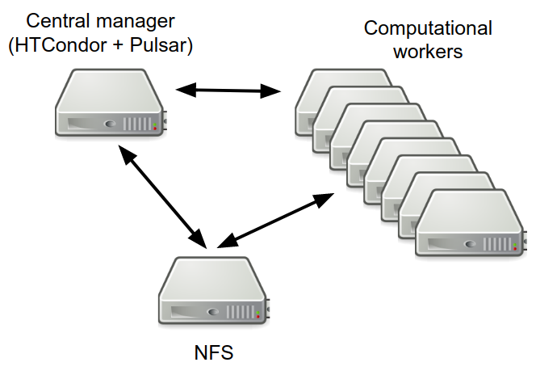
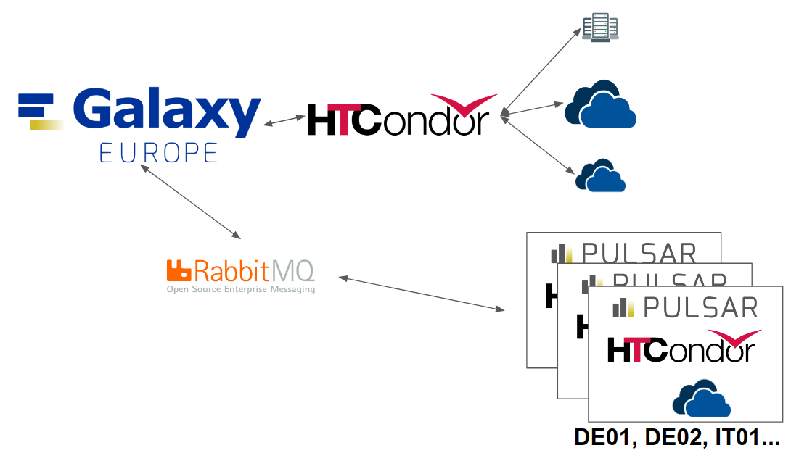

Introduction
============

This framework exploits `HashiCorp Terraform <https://www.terraform.io/>`_ to perform the installation and configuration of a Pulsar Endpoint on OpenStack using a Virtual imaged named VGCN (see :doc:`requirements` for more details)

The Terraform script needs to access an OpenStack cloud via API to:

- upload a VM image of 4GB (preferred, but we support also a preloading via the Dashboard interface);
- access an ipv4 external network (means a network that can reach internet);
- the external network has a DHCP server enabled that can provide 1 public IP;
- create an ipv4 private network for the VMs (preferred, but we support also to use a pre-existent network of this kind);
- create a router to bridge the private network to the external network (optional, if this feature is provided by the Cloud network infrastructure);
- create one ``central manager`` where all services are installed;
- create one NFS server;
- create N worker nodes;
- attach a storage volume to the NFS server;
- create three secgroups;
- upload an ssh public key to access the Central Manager VM.

Minimal setup
-------------

A minimal setup requires:

- Central manager and NFS server nodes
  each with 4 cores, 8 GB
- Computational workers
  each with 4-8 cores, 16 GB
- 300+ GB volume

but the more the better.

Architecture
------------

Usegalaxy.eu and the remote Pulsar endpoints will communicate through a RabbitMQ queue; in this way, the Pulsar endpoints don't need to expose any open ports to the external.

Dependencies
~~~~~~~~~~~~

All tools dependencies are resolved by UseGalaxy.eu through a container mechanism resolver providing a proper Singularity image for each job.
Singularity images are made available locally through a distribution system enabled by a CVMFS servers network.