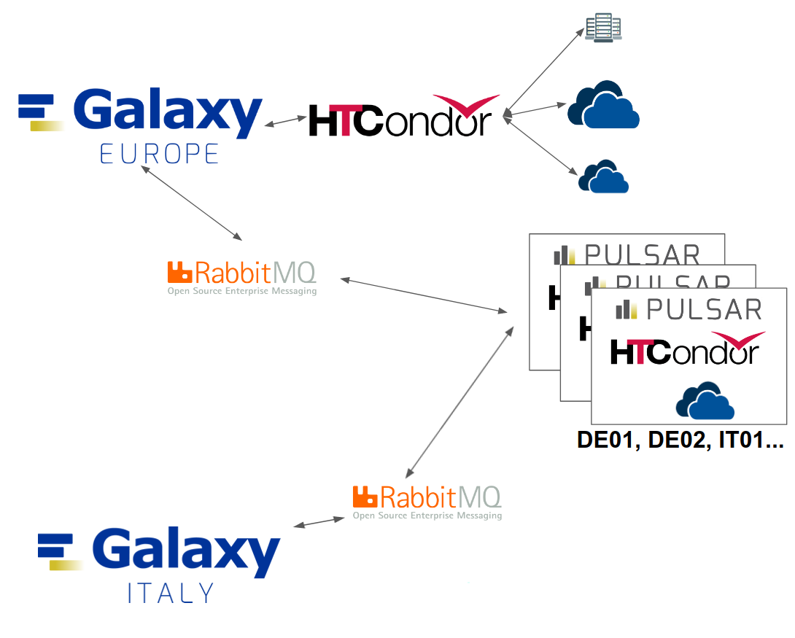

Multiple Pulsar services in one node
====================================

The Pulsar Endpoint can be enabled to accept jobs from multiple Galaxy servers through RabbitMQ queues. Credentials request and configurations procedures are detailed in :doc:`rabbitmq` although few adjustments are necessary. 
The message queue, systemd service of the single deployment are referred as "main" from now on to avoid confusion. 
The procedure remains unchanged for the main Pulsar service. However, for each additional Pulsar service, a Pull Request must be submitted to the corresponding Galaxy infrastructure repository, following the same provided instructions. 

By default the deployment will enable only the main service unless ``extra_mq_urls`` ( found in ``pulsar-deployment/tf/vars.tf`` ) is properly defined.

.. note::
  Already deployed a Pulsar endpoint? See :doc:`post_deploy_pulsar_services`

TPV Configuration
-----------------

.. note::
    Usegalaxy files, updated through pull request, ``files/galaxy/config/user_preferences_extra_conf.yml``, ``group_vars/mq.yml``, ``templates/galaxy/config/job_conf.yml`` for the additional pulsar services can be updated as usual, entering the correct values based on the Pulsar endpoint, the RabbitMQ credentials and virtual host.

The additional job directories cannot be the defaults, since those are used by the main pulsar service. Therefore the TPV configuration described :ref:`here <tpv-configuration>` has to be adjusted to include the supplementary directories under ``params``.
Below is an example of an extra pulsar service destination, to highlight the differences a diff was used against the main configuration:

  ::

    vim files/galaxy/tpv/destinations.yml.j2

  ::

      pulsar_test01_tpv:
      max_accepted_mem: 30
      min_accepted_gpus: 0
      max_accepted_gpus: 0
    +  params:
    +    jobs_directory: "/data/share/test01/staging"
    +    persistence_directory: "/data/share/test01/persisted_data"
      scheduling:
        require:
          - test01-pulsar 

Single Command Deployment
-------------------------

The deployment of multiple pulsar services in one node can be done through the single command line ``terraform apply`` as described thoroughly in :doc:`build_pulsar_node`. The only difference is the addition of a single variable of type **map** to the command.

After having edited accordingly the the Terraform files (see: :doc:`configuration` and :doc:`build_pulsar_node`) execute the following command:

::

  terraform init

  terraform plan

  terraform apply -var "pvt_key=~/.ssh/<key>" -var "condor_pass=<condor-passord>" -var "mq_string=pyamqp://<pulsar>:<password>@mq.galaxyproject.eu:5671//pulsar/<pulsar>?ssl=1" -var 'extra_mq_urls={test01="pyamqp_url01", test02="pyamqp_url02"}'

.. warning::
   In the provided command, single quotes (``'``) are used for the last argument (``extra_mq_urls``) to avoid parsing errors caused by double quotes (``"``) inside the variable value.
   Ensure proper escaping of quotes when using complex strings with nested quotes to prevent unexpected behavior or syntax errors during execution.

Multiple Pulsar services deployment variables details
-----------------------------------------------------

.. note::
   The addition of extra pulsar services requires only ``extra_mq_urls`` when using the recommended defaults and following this guide.

Terraform variables
^^^^^^^^^^^^^^^^^^^

``extra_mq_urls``
"""""""""""""""""

  :Description:
      Additional message queues are defined as a key-value map. **Keys define systemd unit and directory names**, while values specify the corresponding message queue URLs.

      **Validation Rules:**
        * Values must not include ``mq_string``.
        * All values in the map must be unique.

      If no ``extra_mq_urls`` are provided (the variable is left with the default value), no additional pulsar services are enabled.

  :Example:

      ::

        // set this variables during execution, to avoid storage of sensitive data in the Terraform state file with the following argument
        // -var 'extra_mq_urls={test01="pyamqp_url01", test02="pyamqp_url02"}'

  :Reminder:
      Duplicated keys will overwrite older key-value pairs silently. Ensure all keys are unique to avoid unexpected behavior, duplicated message queues are not allowed by the validation rules.

``norm_ex_mqs``
"""""""""""""""

  :Description:
      This local variable **must be left untouched**: it manages the logic of ``extra_mq_urls`` which will be wrapped in the appropriate Ansible dictionary name (``ex_mqs_dict``) when valid values are defined. If ``extra_mq_urls`` has its default values, ``jsonencode(local.norm_ex_mqs)`` will pass to the Ansible playbook an empty dictionary, giving the possibility to define ``ex_mqs_dict`` elsewhere ( i.e. Ansible Vault ) without the risk of overwriting the value. 

.. _multi-variables:

Ansible variables
^^^^^^^^^^^^^^^^^

``ex_mqs_dict``
"""""""""""""""

  :Description:
      Dictionary containing the key-value pairs of additional RabbitMQ queues. **Keys define systemd unit and directory names**. It is passed to the Ansible playbook during Terraform execution.

  :Example:

    ::

      ex_mqs_dict:
        test01: "pyamqp://<your-rabbit-mq-user>_test01:<the-password-we-provided-to-you>@mq.galaxyproject.eu:5671//pulsar/<your-rabbit-mq-vhost>?ssl=1"
        test02: "pyamqp://<your-rabbit-mq-user>_test02:<the-password-we-provided-to-you>@mq.galaxyproject.eu:5671//pulsar/<your-rabbit-mq-vhost>?ssl=1"

..  warning::
    Even when not passed through Terraform, the variable will be subjected to the same validation rules as ``extra_mq_urls`` to avoid conflicts between services and unexpected behaviors. To disable it, when launching manually the playbooks ``main.yml`` or ``post_deploy_pulsar_services.yml``, set ``tf_var_check`` to ``true``.

.. note::
   The default paths are defined in ``pulsar-deployment/tf/ansible/main.yml`` along with `Ansible Pulsar Role <https://github.com/usegalaxy-eu/ansible-pulsar>`_ variables, with the same values used during the `VGCN <https://github.com/usegalaxy-eu/vgcn>`_ image build. Those variables can be left unchanged.

The central manager is still configured with Ansible at deployment time. The following table provides a summary of the directory paths and variables for reference and clarity.

.. list-table:: Additional Pulsar Services Variables
  :header-rows: 1

  * - Variable
    - Default Value
    - Shared by Pulsar Services
    - Details
  * - ``mq_id``
    - Defined when iterating through ``ex_mqs_dict``
    - ...
    - Key of the current key-value pair used by Ansible during iteration. 
  * - ``pulsar_container_image_cache_path``
    - "/data/share/var/database/container_cache"
    - Yes
    - ...
  * - ``pulsar_data_path``
    - "/data/share/{{ mq_id }}"
    - No
    - The parent directory is used by the main Pulsar service. The original value of this variable is overwritten in the task to add new pulsar services.
  * - ``pulsar_persistence_dir``
    - "{{ pulsar_data_path }}/persisted_data"
    - No
    - ...
  * - ``pulsar_staging_dir``
    - "{{ pulsar_data_path }}/staging"
    - No
    - ...
  * - ``pulsar_config_dir`` 
    - "{{ pulsar_root }}/config\_{{ mq_id }}"
    - No
    - The parent directory is shared by all Pulsar services
  * - ``pulsar_venv_dir``
    - "{{ pulsar_root }}/venv3""
    - Yes
    - ...
  * - ``pulsar_system_service_name``
    - "pulsar\_{{ mq_id }}"
    - No
    - ...

