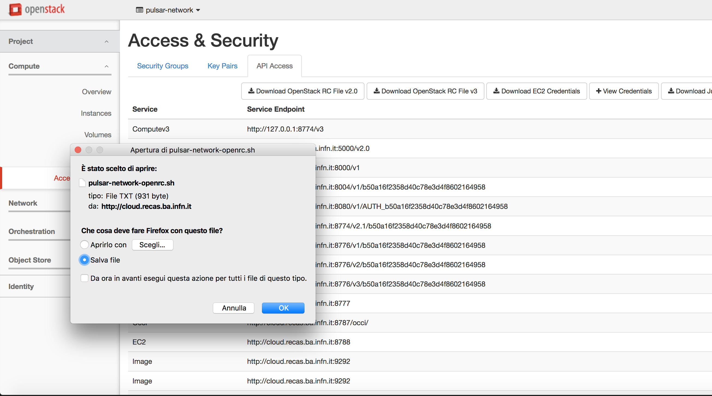
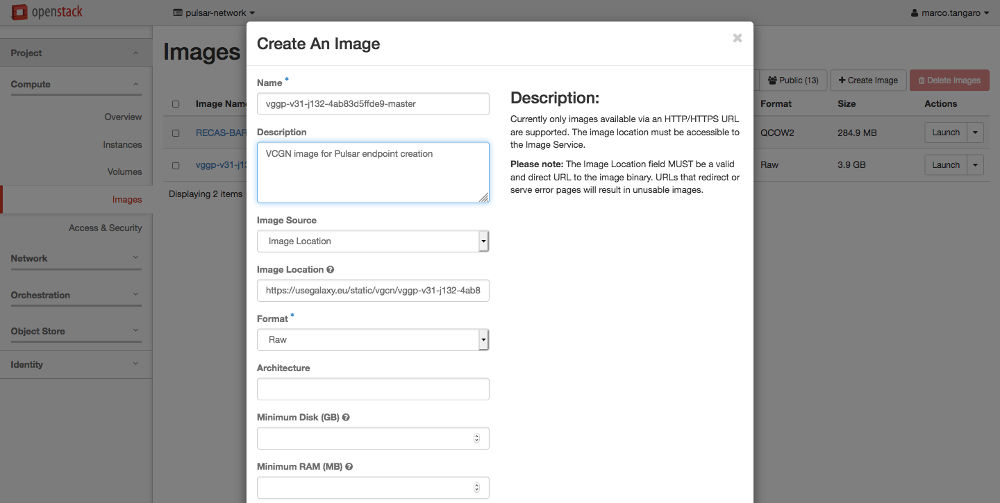

Requirements
============

OpenStack configuration
-----------------------

Access to an OpensStack tenant is needed to perform the Pulsar endpoint installation.

To allow Terraform to access the Tenant download the **OpenStack RC File v2.0 (v3)** from your OpenStack dashboard and source it.



::

  $ source pulsar-network-openrc.sh 

Pulsar need both private and public network to properly work. Moreover, the private network needs to access to the internet.
This is needed to allow the Pulsar Compute Nodes to mount CVMFS repositories to get access to Galaxy reference data or Containers.

Uploading the Disk Images
-------------------------

The Pulsar network exploits a Virtual Image, named `VGCN <https://github.com/usegalaxy-eu/vgcn>`_, with everything necessary to create a Pulsar Network node.

The image contains:
    
    - Pulsar
    - NFS
    - CVMFS
    - Apptainer (formerly Singularity)
    - Docker

and must be available in your Tenant.

Depending on the OpenStack configuration you will be available to upload the image by URL or not. In the first case the image can be installed straightforwardly using the :doc:`pretasks` recipes.

Alternatively, the OpenStack Horizon Dashboard allows to upload an image by URL or a local image.

.. note::

   The current VCGN images are located `here <https://usegalaxy.eu/static/vgcn/>`_.

Before starting installation of the endpoint, we need to upload two disk images to our instance. These images are for CPU and GPU based worker nodes, respectiverly. First, we need to download these images to our system. As the day of writing this documentation, the images are located at the following URLs:

- `CPU Worker Node <https://usegalaxy.eu/static/vgcn/vggp-v60-j225-1a1df01ec8f3-dev.raw>`_
- `GPU Worker Node <https://usegalaxy.eu/static/vgcn/vggp-gpu-v60-j16-4b8cbb05c6db-dev.raw>`_

Each image is around 6.6GB. Please use a download accelerator like `aria2c` or `axel` to download with high speed.

.. note::

   Please upload the GPU image only if you plan to exploit GPUs with your Pulsar endpoint.

After downloading the images, we need to upload to the OpenStack project. To do this, use the following steps:

1. Login to the OpenStack dashboard with your user.
2. Navigate to Compute ->  Images.
3. Click `+ Create Image` from top right.
4. Fill the page fields:

	- For CPU based worker node image name use `vggp-v60-j225-1a1df01ec8f3-dev`, and for GPU based worker node image use `vggp-gpu-v60-j16-4b8cbb05c6db-dev`.
	- Fill the descriptions the way you see fit.
	- `Browse...` your system and find the correct image, and select it.
	-  Select `RAW` from format.
	-  Do not fill/change "Image requirements" section.
	-  Set Image Sharing to "Private"
	-  Click `Create Image`.
	- The file will take some time to upload. Grab a coffee.



Configuring the Appliance, Terraform & Ansible
----------------------------------------------

Installing the Appliance
^^^^^^^^^^^^^^^^^^^^^^^^

For operational flexibility, it's recommended to install an independent small VM  alongside the Pulsar site to handle Terraform & Ansible tasks. This node needs to contain the following tools installed.

- `git`, since a lot of configuration data is stored in Git repositories.
- `terraform`, since it's the main tool which installs the infrastructure itself.
- `ansible`, to be able to automatically further configure the nodes we have created via Terraform.
- Your favorite text editor. All of them are great. No flamewars, please.

There's no hard requirement on the flavor of Linux you're going to use for this node. Any well supported, enterprise level distribution with a long support cycle is a prime choice. If you prefer RHEL based systems, AlmaLinux is a good choice. If you prefer Debian based systems, Debian Stable is another great choice. This document will assume AlmaLinux is used.

To install your appliance, [download](https://mirrors.almalinux.org/isos/x86_64/9.2.html) AlmaLinux and install it as "minimal install". It's recommended to install "guest agents" too, if you're installing on a virtualization platform (Proxmox, OpenStack, QEMU, etc.). For this appliance, 2 cores, 2-4 GB of RAM and 20GB disk is more than enough, even for the future.

After installation completes, please completely update your OS with `dnf update`, and reboot. Then, installation of following packages are recommended for quality of life while working with your appliance:

1. `epel-release` (Please install first & independently)
2. `screen`
3. `yum-utils`
4. `vim`
5. `bash-completion`
6. `multitail`
7. `jq`

After installing these packages, and making other quality of life improvements you want to do on your appliance, then we can install Terraform on the appliance.

Installing Terraform
^^^^^^^^^^^^^^^^^^^^

Terraform is a tool which manages your infrastructure with "Infrastructure as code" paradigm. It's used to deploy The Pulsar Endpoint in tandem with Ansible.

Installation of Terraform is straightforward. In essence, for AlmaLinux (and other RedHat based distributions), it's three commands:

```bash
$ sudo yum install -y yum-utils
$ sudo yum-config-manager --add-repo https://rpm.releases.hashicorp.com/RHEL/hashicorp.repo
$ sudo yum -y install terraform
```

.. note:: 

   You can install the packages without `sudo` if you have `root` user access, too.

For more information, and other ways to install Terraform, see the [official documentation](https://developer.hashicorp.com/terraform/downloads?product_intent=terraform).

Installing Ansible
^^^^^^^^^^^^^^^^^^

Since Ansible is an RedHat project, it's directly packaged in AlmaLinux repositories, too. It can be directly installed with

```bash
$ sudo dnf install ansible vim-ansible
```

We're installing `vim-ansible` since it provides quality of life improvements while editing playbook files.

After installling Terraform & Ansible, the next step is to get the Terraform files so we can start to apply it to our infrastructure and start building our Pulsar endpoint.
